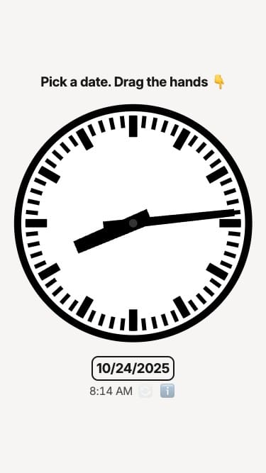

# Clockwork Date Picker

Drag the clock hands to pick any time. Simple, tactile, satisfying.



https://github.com/user-attachments/assets/1a0fa228-2864-4faa-a4ac-aedbae49661e

## Run

Just open `index.html` in your browser. Or run a dev server:

```bash
bun start
```

## Controls

- **Drag** the clock hands
- **Scroll** with mouse wheel
- **Swipe** vertically on touch
- **Reset** with 🔄 button
- **10x speed**: Hold Shift or two fingers

## Features

- iOS-style tick sounds
- Auto color themes based on sun position
- Live favicon
- No dependencies

